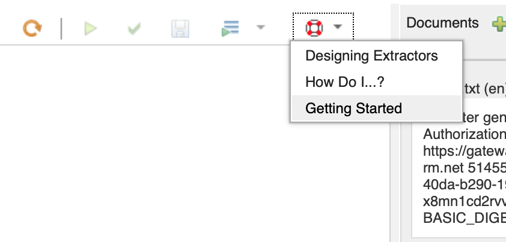
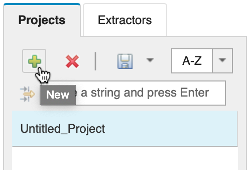
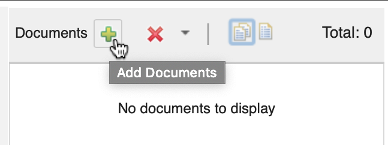

---

copyright:
  years: 2019, 2022
lastupdated: "2022-04-06"

subcollection: watson-knowledge-studio-data

---

{:shortdesc: .shortdesc}
{:new_window: target="_blank"}
{:tip: .tip}
{:pre: .pre}
{:warning: .warning}
{:important: .important}
{:note: .note}
{:codeblock: .codeblock}
{:screen: .screen}
{:javascript: .ph data-hd-programlang='javascript'}
{:java: .ph data-hd-programlang='java'}
{:python: .ph data-hd-programlang='python'}
{:swift: .ph data-hd-programlang='swift'}

# Creating an advanced rules model
{: #create-advanced-rules-model}

This tutorial describes how to use advanced rules workspaces to create and export advanced rules models.

The advanced rules workspace is Beta. The feature is in a trial stage of development and is not recommended for use in production environments.
{: important}

## Before you begin
{: #create-advanced-rules-model-before-you-begin}

1. [Install {{site.data.keyword.knowledgestudioshort}}](/docs/watson-knowledge-studio-data?topic=watson-knowledge-studio-data-install).
1. Confirm you are using a [supported browser](/docs/watson-knowledge-studio-data?topic=watson-knowledge-studio-data-system-requirements). 

## Accessing tutorials from the advanced rules workspace
{: #accessing-advanced-rules-tutorials}

To view tutorials for creating extractors, click the **Get Help** button in the upper right corner of the center canvas. You might need to slide the documents bar to expose the icon if the icon is not visible.

## Creating an advanced rules model
{: #create-advanced-rules-model-procedure}

Advanced rules models are comprised of text extractors that you design in the advanced rules workspace. The advanced rules workspace provides sample text extractors that are ready to use. 

1. Create an advanced rules workspace

    1. [Launch the {{site.data.keyword.knowledgestudioshort}} application](/docs/watson-knowledge-studio-data?topic=watson-knowledge-studio-data-wks_tutintro#launching-the-knowledge-studio-application).
    1. If you already have other workspaces, click **Create workspace**.
    1. Click **Create advanced rules workspace**. Enter a name for your workspace, then click **Create**. The advanced rules workspace will load after a few seconds.

1. Create a new project (optional)

     
    1. In the **Projects** tab of your workspace, click the **New** button.
    2. Enter a name for your project and click **Create**.

    For more information, see [Managing projects and extractors](/docs/watson-knowledge-studio-data?topic=watson-knowledge-studio-data-managing-projects-and-extractors).

1. Add documents to your project

     

    1. Click the **Add Documents** button.
    2. Select the file type and language of your file.
    3. Click **Choose File** and select a file to upload.
    4. Click **Add** to add your file to the project.

1. Create an extractor

    1. Follow the tutorials from the **Get Help** menu for more information on how to create and run extractors. See [Managing projects and extractors > Creating an extractor](/docs/watson-knowledge-studio-data?topic=watson-knowledge-studio-data-managing-projects-and-extractors#creating-an-extractor).

1. Run your extractors on documents

    1. Right-click the extractor on the canvas and click Run Selected from the menu. 
    2. Alternatively, select the extractor and click Run Selected from the extractor toolbar.
    3. To run multiple extractors, select them and click Run Selected in the toolbar. When the extractor has finished running, click the Results pane to view the output. The results are highlighted in the Documents pane as well.

    For more information, see [Managing projects and extractors > Running an extractor](/docs/watson-knowledge-studio-data?topic=watson-knowledge-studio-data-managing-projects-and-extractors#running-an-extractor).

1. Export your model

    1. Click **Save** to save your model.
    1. In the **Extractors** pane, right-click an extractor category, or right-click a single view under an extractor category. Click **Export**.
    1. If you want the model to be able to analyze HTML content and output spans over the HTML tags in {{site.data.keyword.nlushort}}, select **Enable Detagging**.
    1. Enter the **Name of file**, then click **OK**.
    
    Exporting a model from a Category, if multiple concepts internally use the same names for one or more output views, is expected to fail when deploying to {{site.data.keyword.discoveryshort}} or {{site.data.keyword.nlushort}}.

### Uploading an advanced rules model to other services
{: #uploading-to-other-services}

After you export an advanced rules model, you can upload it to {{site.data.keyword.nlushort}}. See the following page for more details.

- {{site.data.keyword.nlushort}}: [Customizing > Analyzing text with advanced rules (Beta)](/docs/natural-language-understanding?topic=natural-language-understanding-customizing#advanced-rules)
- {{site.data.keyword.discovery-data_short}}: [Creating enrichments > Advanced rules models enrichment (Beta)](/docs/discovery-data?topic=discovery-data-domain#advanced-rules)
